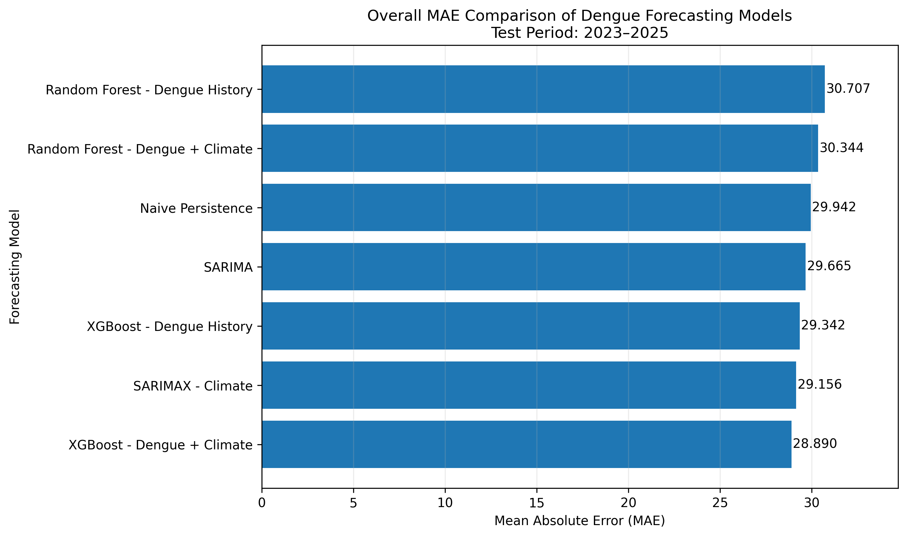
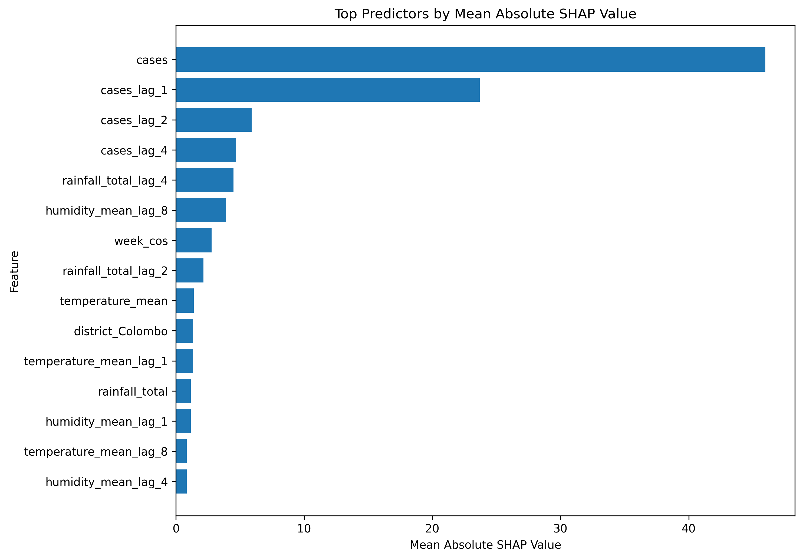
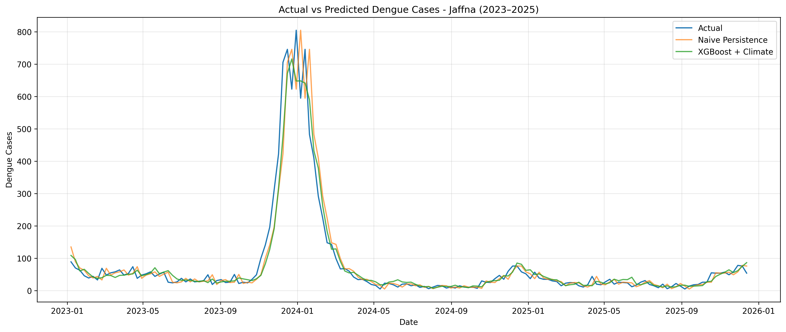
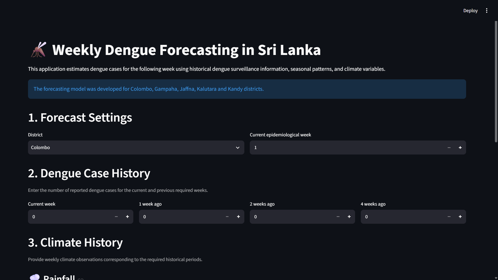
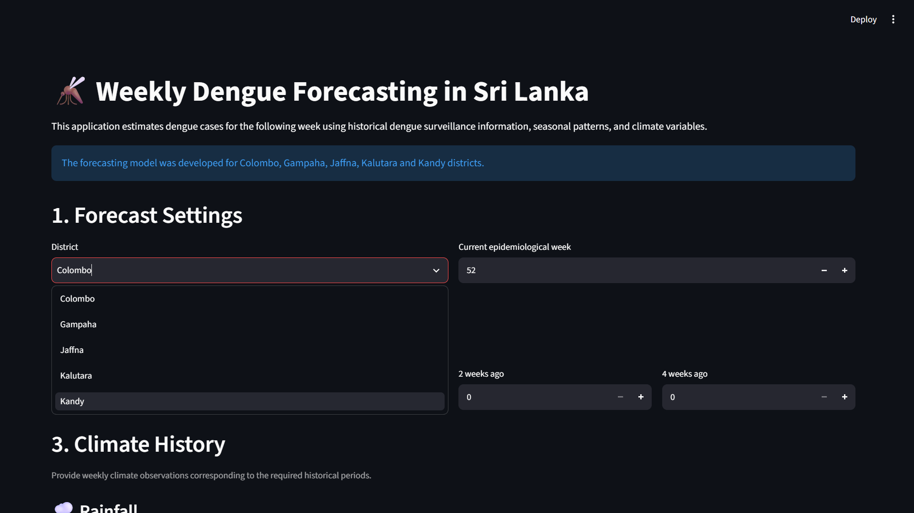
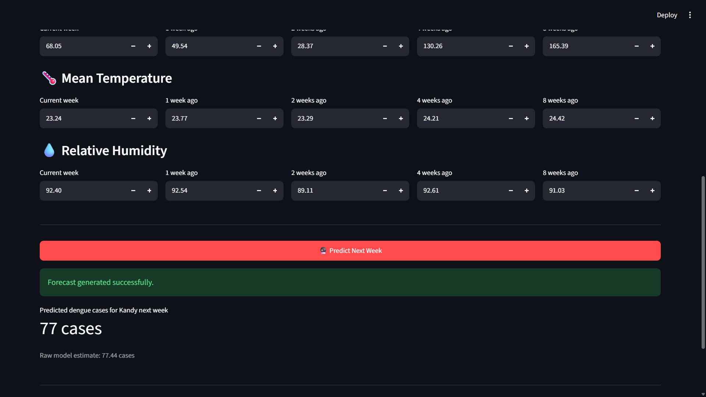

# Weekly Dengue Case Forecasting in Sri Lanka

An end-to-end machine learning and time-series forecasting project for predicting weekly dengue cases in five selected districts of Sri Lanka using historical dengue surveillance data and climate variables.

The project compares traditional statistical forecasting methods with machine learning models, evaluates the contribution of climate information, applies SHAP for model interpretation, and provides an interactive Streamlit application for next-week dengue case prediction.

## Project Overview

Dengue remains an important public health concern in Sri Lanka. Accurate short-term forecasting can support awareness, planning, and resource allocation.

This project focuses on forecasting dengue cases one week ahead for five selected districts:

- Colombo
- Gampaha
- Jaffna
- Kalutara
- Kandy

Historical dengue case data were combined with climate information including rainfall, temperature, and relative humidity.

## Objectives

The main objectives of this project were to:

- Prepare and integrate weekly dengue and climate datasets.
- Engineer lag-based and seasonal forecasting features.
- Compare machine learning and traditional time-series models.
- Evaluate whether climate information improves forecasting performance.
- Interpret the final machine learning model using SHAP.
- Deploy the forecasting model through an interactive Streamlit application.

## Data Sources

### Dengue Data

Weekly dengue case data were obtained through the `denguedatahub` data source.

The original dataset contained information including:

- Year
- Epidemiological week
- Start date
- End date
- District
- Number of dengue cases

### Climate Data

Climate data were obtained from NASA POWER.

The climate variables used were:

- `PRECTOTCORR` — precipitation/rainfall
- `T2M` — temperature at 2 metres
- `RH2M` — relative humidity at 2 metres

Daily climate observations were converted into weekly measurements:

- Rainfall → weekly total
- Temperature → weekly mean
- Relative humidity → weekly mean

## Feature Engineering

The forecasting dataset included information from recent dengue activity, delayed climate conditions, and seasonal patterns.

### Dengue Features

- Current dengue cases
- 1-week lag
- 2-week lag
- 4-week lag

### Climate Features

For rainfall, temperature, and humidity:

- 1-week lag
- 2-week lag
- 4-week lag
- 8-week lag

### Seasonal Features

Week-of-year seasonality was represented using cyclical transformations:

- `week_sin`
- `week_cos`

The target variable was the number of dengue cases in the following week.

## Train-Test Strategy

A chronological split was used instead of random sampling because this is a forecasting problem.

- **Training period:** March 2007 – December 2022
- **Testing period:** January 2023 – December 2025

This ensures that the models learn from historical observations and are evaluated on future observations, reducing the risk of temporal data leakage.

## Models Evaluated

The project compared seven forecasting configurations:

1. Naive Persistence
2. Random Forest — Dengue History
3. Random Forest — Dengue + Climate
4. XGBoost — Dengue History
5. XGBoost — Dengue + Climate
6. SARIMA
7. SARIMAX — Climate

## Overall Results

| Model | MAE | RMSE | R² |
|---|---:|---:|---:|
| Naive Persistence | 29.942 | 57.217 | 0.748 |
| Random Forest — History | 30.707 | 58.607 | 0.736 |
| Random Forest — History + Climate | 30.344 | 57.959 | 0.742 |
| XGBoost — History | 29.342 | 54.500 | 0.772 |
| **XGBoost — History + Climate** | **28.890** | **54.054** | **0.775** |
| SARIMA | 29.665 | 55.007 | 0.766 |
| SARIMAX — Climate | 29.156 | 54.567 | 0.770 |

Among the evaluated configurations, XGBoost using both dengue-history and climate features achieved the strongest overall performance.

The improvement from climate information was modest, however, indicating that recent dengue case history remained the dominant source of predictive information.

## Model Interpretation

SHAP was used to examine the contribution of individual features to the XGBoost model.

The strongest features included:

- Current dengue cases
- Dengue cases one week earlier
- Dengue cases two weeks earlier
- Dengue cases four weeks earlier
- Rainfall lagged by four weeks
- Humidity lagged by eight weeks

The analysis showed that recent dengue history contributed more strongly to predictions than climate variables, while climate features provided additional contextual information.

## Example Visualisations

### Final Model Comparison



### SHAP Feature Importance



### Actual vs Predicted Dengue Cases



## Streamlit Application

An interactive Streamlit application was developed to demonstrate the final forecasting model.

The application allows users to provide:

- District
- Epidemiological week
- Current and historical dengue cases
- Rainfall information
- Temperature information
- Humidity information

The application then produces a one-week-ahead dengue case forecast using the trained XGBoost model.

### Application Preview

#### Main Interface


#### Input Section


#### Prediction Result

## Repository Structure

```text
dengue-forecasting-sri-lanka/
│
├── app/
│   └── app.py
│
├── notebooks/
│   └── Dengue_Forecasting_Sri_Lanka_Final.ipynb
│
├── data/
│   ├── external/
│   │   └── climate_daily_selected_districts.csv
│   └── processed/
│       ├── dengue_climate_weekly.csv
│       └── dengue_forecasting_features.csv
│
├── models/
│   ├── climate_preprocessor.pkl
│   ├── model_b_features.pkl
│   └── xgb_climate_model.pkl
│
├── results/
│   ├── figures/
│   └── tables/
│
├── assets/
│
├── requirements.txt
├── .gitignore
└── README.md